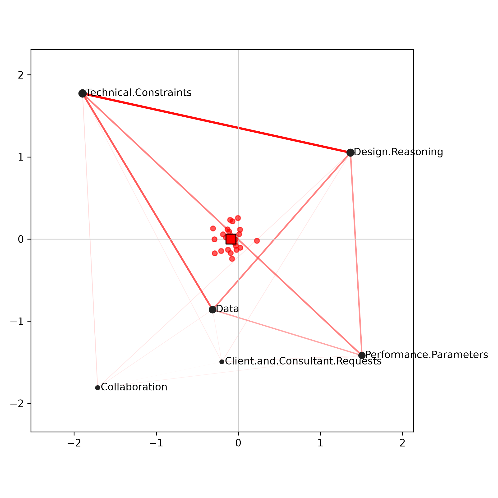
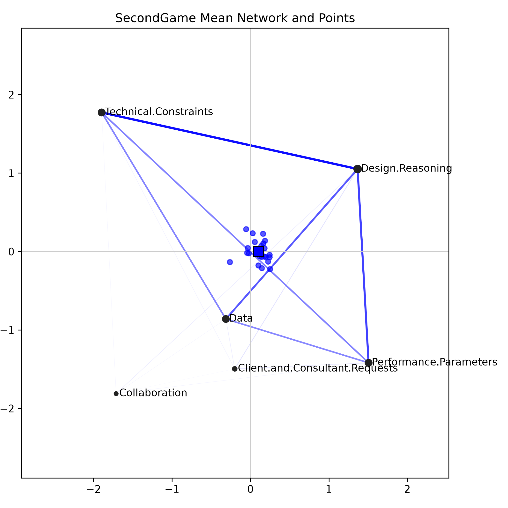
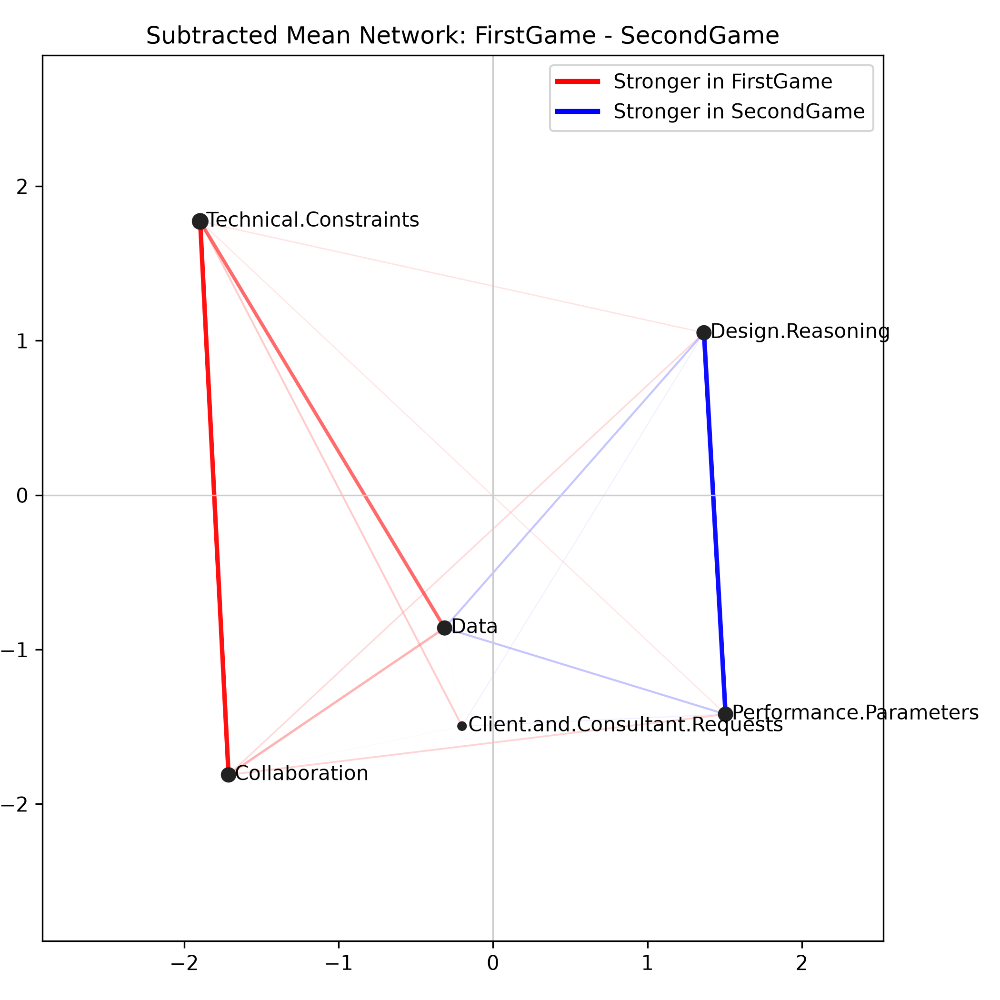

# pyENA

`pyENA` is a Python rewrite of the core workflow in `rENA`, focused on reproducing the standard Epistemic Network Analysis pipeline used in the Shaffer handbook examples.

It currently supports:

- reading coded CSV data
- accumulating co-occurrence vectors by `units` and `conversation`
- `MovingStanzaWindow` and `Conversation` windows
- `EndPoint`, `AccumulatedTrajectory`, and `SeparateTrajectory`
- spherical normalization
- SVD rotation and mean rotation
- point projection, mean networks, and subtracted networks
- matplotlib-based ENA network plots
- Welch t-test, Mann-Whitney / Wilcoxon-style summaries, ANOVA, chi-square summaries, and goodness-of-fit reporting used in the examples

## Files

- `src/pyena/rena.py`: core ENA implementation
- `src/pyena/__init__.py`: public package API
- `example.py`: end-to-end handbook example using `datasets/RS.data.csv`
- `example_leet.py`: end-to-end example using `datasets/leet.csv`
- `datasets/`: example datasets used by the repository
- `datasets/RS.data.csv`: handbook example dataset exported from `rENA::RS.data`
- `datasets/leet.csv`: reflection dataset for the Leet-style example
- `pyproject.toml`: package metadata for `pip install git+...`
- `requirements.txt`: optional local dependency list

## Requirements

- Python 3.10+

Install from GitHub with:

```bash
pip install git+https://github.com/owen198/pyENA.git
```

Then import it in any Python project with:

```python
from pyena import ena, generate_analysis_outputs
```

For local development, you can still create a virtual environment and install in editable mode:

```bash
python3 -m venv .venv
source .venv/bin/activate
pip install -e .
```

## Quick Start

Run the handbook example:

```bash
source .venv/bin/activate
pip install -e .
python3 example.py
```

Run the handbook example in summary-only mode:

```bash
source .venv/bin/activate
pip install -e .
python3 example.py --summary-only
```

Run the Leet example:

```bash
source .venv/bin/activate
pip install -e .
python3 example_leet.py
```

If you already installed `pyENA` from GitHub into another project, you do not need this repository layout. The `example.py` file is mainly for reproducing the handbook workflow from this repo.

`example.py` will:

- read `datasets/RS.data.csv`
- build an ENA model with `MovingStanzaWindow`
- rotate the space using the means of `FirstGame` and `SecondGame`
- call `generate_analysis_outputs(...)` to generate mean networks, subtracted networks, point plots, and individual comparison plots
- save all outputs to `outputs/`
- print the statistical summary to the terminal

`example.py --summary-only` will:

- read `datasets/RS.data.csv`
- build the same ENA model and group comparison
- call `summarize_ena_results(...)` directly instead of generating figures
- write only `outputs/statistical_summary.json`
- print the statistical summary to the terminal

`example_leet.py` will:

- read `datasets/leet.csv`
- use `units = ["Condition", "UserName"]`
- use `conversation = ["Condition", "ActivityNumber"]`
- use the code columns `data.pandas`, `list.set`, `loop.loops`, and `statement.conditions`
- compare the groups `HDSE` and `LDSE`
- save all outputs to `outputs_leet/`
- print the statistical summary to the terminal

## Output Files

Running `example.py` will generate files such as:

- `outputs/firstgame_mean_network.png`
- `outputs/secondgame_mean_network.png`
- `outputs/subtracted_mean_network.png`
- `outputs/group_points_overlay.png`
- `outputs/subtracted_network_with_points.png`
- `outputs/subtracted_individual_network.png`
- `outputs/statistical_summary.json`

Running `example.py --summary-only` will generate:

- `outputs/statistical_summary.json`

Running `example_leet.py` will generate the same style of outputs under `outputs_leet/`, including:

- `outputs_leet/hdse_mean_network.png`
- `outputs_leet/ldse_mean_network.png`
- `outputs_leet/subtracted_mean_network.png`
- `outputs_leet/group_points_overlay.png`
- `outputs_leet/subtracted_network_with_points.png`
- `outputs_leet/subtracted_individual_network.png`
- `outputs_leet/statistical_summary.json`

Example visual outputs from `example.py`:







## `statistical_summary.json`

The `statistical_summary.json` file is the main machine-readable summary produced by `generate_analysis_outputs(...)`.

At a high level, it contains:

- `groups`: the grouping column and the two group labels being compared
- `model`: core model metadata such as number of units, number of edges, codes, eigenvalues, and explained variance ratios
- `points`: group-level point summaries in the ENA space
- `statistics`: inferential statistics and fit summaries
- `axis_interpretation`: heuristic summaries of what each ENA dimension appears to distinguish
- `networks`: mean networks, the subtracted mean network, and the strongest positive and negative edge differences

### Included indicators

The JSON currently reports the following indicators and related descriptions.

| Indicator | JSON location | What it means |
| --- | --- | --- |
| Mean point | `points.group_a.mean_point`, `points.group_b.mean_point` | The average projected ENA location for each group. This is the group centroid in the plotted ENA space. |
| Median point | `points.group_a.median_point`, `points.group_b.median_point` | The median projected ENA location for each group on the two plotted dimensions. Useful when point distributions are skewed. |
| 95% confidence interval for group points | `points.group_a.confidence_interval_95`, `points.group_b.confidence_interval_95` | The uncertainty interval around each group's mean point on each ENA dimension. |
| Welch t-test | `statistics.welch_t_test.dimension_1`, `statistics.welch_t_test.dimension_2` | Tests whether the two groups differ in their projected ENA coordinates on each dimension without assuming equal variance. |
| `t_statistic` | inside `welch_t_test` | The Welch t statistic for a dimension-level group comparison. |
| `p_value` | inside `welch_t_test`, `mann_whitney_u`, `anova`, and `chi_square` | The probability of observing a result at least this extreme under the null hypothesis. |
| Degrees of freedom | `statistics.welch_t_test.*.degrees_of_freedom` | The Welch-Satterthwaite degrees of freedom used for the t-test. |
| Mean and SD by group | `statistics.welch_t_test.*.mean_x`, `mean_y`, `sd_x`, `sd_y` | Descriptive statistics for the two groups on each ENA dimension. |
| Cohen's d | `statistics.welch_t_test.*.cohens_d` | Standardized group difference size for each ENA dimension. |
| 95% confidence interval for mean difference | `statistics.welch_t_test.*.confidence_interval_95` | Confidence interval for the difference between group means on each dimension. |
| Mann-Whitney U | `statistics.mann_whitney_u.dimension_1`, `statistics.mann_whitney_u.dimension_2` | Non-parametric test of whether the two groups differ in their projected ENA coordinates on each dimension. |
| U statistic | `statistics.mann_whitney_u.*.u_statistic` | The Mann-Whitney U value for the dimension-level comparison. |
| Median by group | `statistics.mann_whitney_u.*.median_x`, `median_y` | The two group medians used in the non-parametric summary. |
| Approximate effect size `r` | `statistics.mann_whitney_u.*.effect_r_approx` | Approximate effect size derived from the Mann-Whitney result. |
| One-way ANOVA | `statistics.anova.dimension_1`, `statistics.anova.dimension_2` | Parametric between-group comparison of projected ENA coordinates on each dimension. In a two-group setting, this is a companion summary to the t-test. |
| F statistic | `statistics.anova.*.f_statistic` | The ANOVA F value for the group comparison on a given ENA dimension. |
| Chi-square | `statistics.chi_square` | Frequency-based comparison of binary code presence across the two groups. This is separate from ENA point-space tests and focuses on code occurrence counts. |
| Overall chi-square | `statistics.chi_square.overall` | Chi-square test over the two-by-code contingency table. |
| Per-code chi-square | `statistics.chi_square.per_code` | Separate chi-square summaries for each code, including group counts, rates, and expected values. |
| Goodness of fit | `statistics.goodness_of_fit` | Co-registration fit between the visualized ENA point space and the underlying network centroids reconstructed from node positions. |
| Co-registration correlations | `statistics.goodness_of_fit.co_registration_correlations` | Pearson and Spearman correlations for each ENA dimension between observed points and fitted centroids. Higher values indicate a closer match between the visualization and the original model geometry. |
| Explained variance ratio | `model.explained_variance_ratio` | The proportion of retained variance captured by each plotted dimension. |
| Mean network | `networks.group_a_mean_network`, `networks.group_b_mean_network` | Average edge weights for each group. These show the representative co-occurrence structure for the group. |
| Subtracted mean network | `networks.subtracted_mean_network` | Edge-by-edge difference computed as `group_a_mean_network - group_b_mean_network`. Positive values indicate stronger edges for group A, negative values indicate stronger edges for group B. |
| Top edge differences | `networks.subtracted_mean_network_top_edges` | The strongest positive and negative edges in the subtraction network. |
| Axis interpretation | `axis_interpretation.dimension_1`, `axis_interpretation.dimension_2` | Heuristic interpretation of each ENA dimension based on the most positive and most negative node coordinates in the co-registered space. |

### Notes on interpretation

- The ENA point-space tests such as Welch t-test, Mann-Whitney U, and ANOVA evaluate differences in projected ENA positions. They do not test whether a single edge is independently significant.
- The chi-square summary is intentionally different from the ENA point-space tests. It operates on binary code presence counts in the original coded rows and is best interpreted as a frequency-based companion analysis.
- The goodness-of-fit summary is related to the quality of the visualization, not the size of the group separation. A strong visual gap between groups does not by itself imply a strong goodness of fit.
- The axis interpretation block is heuristic. It is designed to help orient interpretation, but it should be read together with the mean networks and subtracted network rather than treated as a standalone substantive conclusion.

## Troubleshooting

### Singular matrix while estimating node positions

If ENA set construction fails with a message such as:

```text
Failed to estimate ENA node positions because the node-position least-squares matrix is singular.
```

this means the node-position system is rank-deficient. In practice, this usually happens when:

- some codes never appear after accumulation
- some codes always co-occur in nearly fixed proportions
- too few active units remain after zero line weights are filtered out

`pyENA` now raises a readable error message instead of exposing a raw `numpy.linalg.LinAlgError`. The message includes:

- total units and active units
- the rank of the node-weight matrix
- inactive codes after accumulation
- near-constant code columns

These diagnostics help you identify whether the issue comes from sparse coding, collapsed group structure, or overly aggressive filtering.

### Welch t-test requires at least two points per group

If summary generation fails with a message such as:

```text
Welch t-test requires at least 2 points per group, but received n_x=1 and n_y=12.
```

then one of your groups has fewer than two projected ENA points. Welch's t-test and one-way ANOVA both require at least two observations per group to estimate within-group variance.

In practice, this usually means:

- one group only contains a single unit
- filtering left one group with only one valid point
- the grouping variable produced an extremely unbalanced split

When this happens, check the size of each group before running inferential summaries. The descriptive ENA outputs may still be meaningful, but group-comparison tests that rely on within-group variance are not defined for `n < 2`.

## Minimal Usage Example

```python
from pathlib import Path

from pyena import ena, generate_analysis_outputs, group_network, group_points, summarize_ena_results

data_path = Path("datasets/RS.data.csv")

codes = [
    "Data",
    "Technical.Constraints",
    "Performance.Parameters",
    "Client.and.Consultant.Requests",
    "Design.Reasoning",
    "Collaboration",
]

ena_set = ena(
    data=data_path,
    units=["Condition", "UserName"],
    conversation=["Condition", "GroupName"],
    metadata=["Condition", "GroupName"],
    codes=codes,
    model="EndPoint",
    window="MovingStanzaWindow",
    window_size_back=4,
    rotation="mean",
    group_column="Condition",
    groups=("FirstGame", "SecondGame"),
)

outputs = generate_analysis_outputs(
    ena_set=ena_set,
    output_dir=Path("outputs"),
    group_a_label="FirstGame",
    group_b_label="SecondGame",
    group_column="Condition",
    group_a_color="#ff0000",
    group_b_color="#0000ff",
    group_a_line_colors=("#ff0000", "#ff0000"),
    group_b_line_colors=("#0000ff", "#0000ff"),
    subtracted_line_colors=("#ff0000", "#0000ff"),
    focus_unit_a="FirstGame::steven z",
    focus_unit_b="SecondGame::samuel o",
)

print(outputs["stats_summary"])
print(outputs["generated_files"])
```

Summary-only example:

```python
from pathlib import Path
import json

from pyena import ena, group_network, group_points, summarize_ena_results

data_path = Path("datasets/RS.data.csv")
output_dir = Path("outputs")
output_dir.mkdir(exist_ok=True)

codes = [
    "Data",
    "Technical.Constraints",
    "Performance.Parameters",
    "Client.and.Consultant.Requests",
    "Design.Reasoning",
    "Collaboration",
]

group_column = "Condition"
group_a_label = "FirstGame"
group_b_label = "SecondGame"

ena_set = ena(
    data=data_path,
    units=["Condition", "UserName"],
    conversation=["Condition", "GroupName"],
    metadata=["Condition", "GroupName"],
    codes=codes,
    model="EndPoint",
    window="MovingStanzaWindow",
    window_size_back=4,
    rotation="mean",
    group_column=group_column,
    groups=(group_a_label, group_b_label),
)

group_a_network = group_network(ena_set, group_column, group_a_label)
group_b_network = group_network(ena_set, group_column, group_b_label)
group_a_points = group_points(ena_set, group_column, group_a_label)
group_b_points = group_points(ena_set, group_column, group_b_label)

summary = summarize_ena_results(
    ena_set=ena_set,
    group_a_label=group_a_label,
    group_b_label=group_b_label,
    group_column=group_column,
    group_a_points=group_a_points,
    group_b_points=group_b_points,
    group_a_network=group_a_network,
    group_b_network=group_b_network,
    subtracted_mean_network=group_a_network - group_b_network,
)

summary_path = output_dir / "statistical_summary.json"
summary_path.write_text(json.dumps(summary, indent=2), encoding="utf-8")

print(summary_path)
print(summary["statistics"])
```

## Main API

### `ena(...)`

High-level wrapper that runs:

1. `accumulate_data(...)`
2. `make_set(...)`

Use this when you want the full ENA result in one step.

### `accumulate_data(...)`

Builds accumulated adjacency vectors from coded event data.

Important arguments:

- `data`: CSV path or `list[dict]`
- `codes`: code column names
- `units`: columns defining the analytic unit
- `conversation`: columns defining the conversation segment
- `metadata`: metadata columns to preserve
- `model`: `"EndPoint"`, `"AccumulatedTrajectory"`, or `"SeparateTrajectory"`
- `window`: `"MovingStanzaWindow"` or `"Conversation"`
- `window_size_back`: backward window size
- `window_size_forward`: forward window size

### `make_set(...)`

Takes accumulated vectors and computes:

- normalization
- centering
- rotation
- projected point coordinates
- node positions

### `mean_network(...)`

Returns the average edge-weight vector for a selected set of units.

### `subtract_networks(...)`

Returns `network_a - network_b`.

### `plot_network(...)`

Draws an ENA network using the node positions stored in the `ENASet`.

### `generate_analysis_outputs(...)`

Generates the full set of handbook-style example plots and the `statistical_summary.json` file from an existing `ENASet`.

## Relationship to `rENA`

This project is intended as a practical Python port of the most commonly used `rENA` workflow, not a full one-to-one reimplementation of every feature in the R package.

As of July 22, 2026, `rENA` exports 85 symbols, while `pyENA` currently exposes a much smaller subset focused on the standard handbook workflow. In other words, `pyENA` already covers the core ENA pipeline, but it does not yet attempt to mirror the full plotting, rotation, reporting, and QE-data helper surface of the R package.

### Core mapping

| rENA | pyENA | Status |
| --- | --- | --- |
| `rENA::ena.accumulate.data()` | `accumulate_data()` | Implemented |
| `rENA::ena.make.set()` | `make_set()` | Implemented |
| `rENA::ena()` | `ena()` | Implemented |
| `rENA::ena.rotate.by.mean()` | `rotate_by_mean()` or `rotation="mean"` | Implemented |
| `rENA::ena.svd()` | `svd_rotation()` or `rotation="svd"` | Implemented |
| `rENA::sphere_norm()` | `sphere_normalize()` | Implemented |
| `rENA::vector_to_ut()` | internal upper-triangle vectorization in `rena.py` | Implemented |
| `rENA::ena.plot.network()` | `plot_network()` | Implemented |
| `rENA::ena.plot.points()` | `create_points_ci_plot()` / `create_points_ci_overlay_plot()` | Partially implemented |
| `rENA::ena.plot.group()` | `create_network_with_point_groups_plot()` | Partially implemented |
| `rENA::ena.plot.trajectory()` | no direct equivalent yet | Missing |
| `rENA::ena.writeup()` | no direct equivalent yet | Missing |

### What `pyENA` already covers well

- coded CSV input
- `MovingStanzaWindow` and `Conversation` accumulation
- `EndPoint`, `AccumulatedTrajectory`, and `SeparateTrajectory`
- spherical normalization and centering
- mean rotation and SVD rotation
- projected unit coordinates
- mean networks and subtracted networks
- handbook-style network and point plots
- Welch t-test and Mann-Whitney / Wilcoxon-style summaries used in the examples

### What is still missing compared with `rENA`

The largest gaps are in the broader package surface rather than the core ENA math:

- additional rotation families such as `ena.rotate.by.generalized()`, `ena.rotate.by.hena.regression()`, and `ena.rotate.by.hena.regression_2()`
- trajectory-specific plotting and helper workflows
- higher-level group, correlation, and optimization helpers such as `ena.group()`, `ena.correlations()`, and `optimize()`
- `rENA`'s QE-data definition helpers such as `define()`, `codes()`, `units()`, `metadata()`, and `horizon()`
- writeup/report generators such as `ena.writeup()`, `methods_report()`, and `methods_report_stream()`
- several plotting convenience layers from the R package, including `add_points()`, `add_network()`, `add_group()`, and `add_trajectory()`

### Practical interpretation

If your goal is to reproduce the standard Shaffer handbook ENA workflow in Python, the current `pyENA` implementation already covers the main path. If your goal is to recreate the entire `rENA` package API, there is still a substantial amount of functionality left to implement.

## Data Format

Each row should represent one coded event, utterance, or observation. Code columns are typically `0/1`, but any numeric values are accepted. Non-zero values are treated as present.

Example:

```csv
Condition,UserName,GroupName,Data,Technical.Constraints,Design.Reasoning,Collaboration
FirstGame,A,G1,1,0,1,0
FirstGame,A,G1,0,1,1,1
SecondGame,B,G2,1,1,0,1
```

## Notes

- `example.py` is the recommended place to start for the handbook dataset.
- `example_leet.py` shows how to adapt the same workflow to a different CSV schema.
- Repository datasets now live under `datasets/`.
- Most reusable helper functions have been moved into `rena.py`.
- The installable package lives under `src/pyena/`.
- Both example scripts assume `pyENA` has already been installed into the current environment.
- The current plotting layer is designed to match the handbook examples closely enough for analysis and replication, while remaining simple to modify.

## Skill

A reusable Codex skill named `interpret-ena-results` is included in this repository:

- `skills/interpret-ena-results/`

To install it for Codex, copy or symlink that folder into your local Codex skills directory:

```bash
ln -s "$(pwd)/skills/interpret-ena-results" ~/.codex/skills/interpret-ena-results
```
